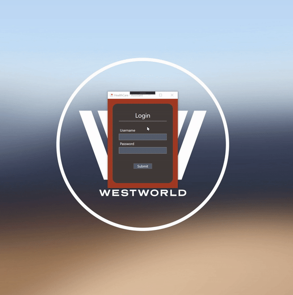

# Orvos - Asszisztens (Kliens - Szerver)

> Egészségügyben használt szoftver "makettprogramja". Képes a doktor és asszisztens közötti kommunikációra és adattárolásra.

> Egy orvosi rendelőben működő kliens – szerver alkalmazás.

## Rövid Galéria

### Autentikációs lehetőség (Orvos és Asszisztens egyaránt)


### Felhasználói felület - Orvos


### Felhasználói felület - Asszisztens


- Autentikáció adatbázison keresztül történik.
- Minden orvosnak/asszisztensnek külön belépési név-belépési jelszó biztosítva.

**Autentikáció akcióban**



**Adatbevitel akcióban**


## Table of Contents (Optional)

- [Installation](#installation)
- [Features](#features)
- [Documentation](#documentation)
- [Tests](#tests)
- [Support](#support)
- [License](#license)


### Appreciation Code! :)
```C

while(viewer.IsWatching()){
  hopeYouEnjoy = true;
}

```


## Installation

- Klónozás
- Web Service elindítása
- Orvos és asszisztens alkalmazás elindítása


### Az Orvos klienst megtalálod a következő link-en:

- <a href="https://github.com/Getlar/WebAPI_Client_Doctor" target="_blank">Orvos</a>


### Az Asszisztens klienst megtalálod a következő link-en:

- <a href="https://github.com/Getlar/WebAPI_Client_Assistant" target="_blank">Asszisztens</a>


## Features

**A szoftver a következő funkciókkal lett ellátva:**

- Asszisztens oldalon minden dolgozó egyedi felhasznaló/jelszó kombinációt kérhet adatbiztonság érdekében.
- Asszisztens oldalon páciensek felvétele adatbázisba ezzel rögzítve az érkező betegeket.
- Asszisztens oldalon már rögzített páciensek érkezési idejének módosítása orvos kérésére.
- Asszisztens oldalon páciensek eltávolítása az adatbázisból esetleges lemondás esetén.
- Asszisztens oldalon adatbázis frissítése orvosi oldalon való módosítás esetén.
</br></br>
- Orvos oldalon minden dolgozó egyedi felhasznaló/jelszó kombinációt kérhet adatbiztonság érdekében.
- Orvos oldalon külön lista az aznapra érkező betegek nevével.
- Orvos oldalon külön lista a jövőben érkező betegek nevével.
- Orvos oldalon külön lista a már diagnoszizált betegek nevével (Asszisztens ezeket már nem látja).
- Orvos oldalon páciensek adatainak megtekintés, írás tiltva.
- Orvos oldalon diagnózis beírása.
- Orvos oldalon adatbázis frissítése asszisztens oldalon való módosítás esetén.
- Orvos oldalon páciensek eltávolítása az adatbázisból.

## Documentation

**Nagyon rövid áttekintés**

    A projekt magja egy REST Web Service .NET Core és WebAPI segítségével,
    ami futtatható akár Linux vagy macOS rendszereken is. Ez a szolgáltatás
    fogja nekünk biztosítani a páciensek adatbázisát és műveleteit.
    Mit tartalmaz a WebAPI_Server solution:
    
      - PersonController.cs - HTTP metódusok
      - Person.cs - Person osztály, ami Person property-ket tartalmaz (Név, Cím, stb.)
      - PersonContext.cs - SQL szerverrel való kapcsolatlétrehozás
      - PersonRepository.cs - Adatbázis műveletek
      - Startup.cs - Konfigurációs lehetőségek beállítása
      - Program.cs - Belépési pontja a projektnek. Web Service környezet felépítése.
      
    A két kliens oldalt egy-egy WPF desktop alkalmazás valósítja meg. Ennek köszönhetően
    grafikus felülettel tudjuk ellátni a programunkat.
    Mit tartalmaz a WebAPI_Client_Assistant solution:
        
      - PersonDataProvider.cs - Adatszolgáltatás Web Service-ünkön kereszül
      - Person.cs - Person osztály, ami Person property-ket tartalmaz (Név, Cím, stb.)
      - LoginScreen.xaml.cs - Loading Screen .xaml Controller-je
      - MainMenu.xaml.cs - Main Menu .xaml Controller-je
      - PersonWindow.xaml.cs - Person Window .xaml Controller-je
      
    Mit tartalmaz a WebAPI_Client solution:
        
      - PersonDataProvider.cs - Adatszolgáltatás Web Service-ünkön kereszül
      - Person.cs - Person osztály, ami Person property-ket tartalmaz (Név, Cím, stb.)
      - LoginScreen.xaml.cs - Loading Screen .xaml Controller-je
      - MainMenu.xaml.cs - Main Menu .xaml Controller-je
      - PersonWindow.xaml.cs - Person Window .xaml Controller-je
      
**Hogy is néz ki egy futtatás?**
- Fontos hogy a Web Service-t indítsuk elsőnek
<br>


    
**Hogy tudok belépni?**
- Jelenleg két-két belépési felhasználónév/jelszó kombináció érhető el a kliensek számára
<br>


**Mit tud az Asszisztens?**
- Érkezési idő módosítás
- Páciens felvétel
- Törlés
<br>


**Mit tud az Orvos?**
- Páciens adatok megtekintése
- Diagnózis felvétele
- Törlés
<br>


** **
## Tests

**Kliens oldalon használt Unit Test-ek**


- CSV (Comma Separated Value) fileból kapott adatok
- Metódusból generált adatok
- Property-ből generált adatok

```C#

        [DataTestMethod]
        [DynamicData(nameof(GetData),DynamicDataSourceType.Method)]
        public void ValidateSSN2(string arg, bool expected)
        {
            PersonWindow pw = new PersonWindow(null);
            bool result = pw.ValidateSocialSecurityNumber(arg);
            Assert.AreEqual(expected, result);
        }

        public static IEnumerable<object[]> GetData()
        {
            yield return new object[] { "245 255  332", false };
            yield return new object[] { " 255 332", false };
            yield return new object[] { "245 abc 332", false };
            yield return new object[] { "111 ", false };
            yield return new object[] { " ", false };
            yield return new object[] { "123 123 123", true };
        }

        [DataTestMethod]
        [DynamicData(nameof(GetData2), DynamicDataSourceType.Property)]
        public void ValidateName2(string arg, bool expected)
        {
            PersonWindow pw = new PersonWindow(null);
            bool result = pw.ValidateName(arg);
            Assert.AreEqual(expected, result);
        }

        public static IEnumerable<object[]> GetData2
        {
            get
            {
                yield return new object[] { "Matyas KIRALY", false };
                yield return new object[] { "Nincs Igazsag", true };
                yield return new object[] { "D N ", false };
                yield return new object[] { "FF D", false };
                yield return new object[] { "Igen Nem", true };
                yield return new object[] { "ddd dd", false };
            }
        }

        public TestContext TestContext { get; set; }

        [DataTestMethod]
        [DataSource("Microsoft.VisualStudio.TestTools.DataSource.CSV",
            @"Data\dates.csv",
            "dates#csv", DataAccessMethod.Sequential)]
        public void ValidateDate2()
        {
            PersonWindow pw = new PersonWindow(null);
            string arg = Convert.ToString(TestContext.DataRow["Date"].ToString());
            bool expected = Convert.ToBoolean(TestContext.DataRow["Expected"].ToString());
            bool result = pw.ValidateDate(arg);
            Assert.AreEqual(expected, result);
        }

```

## Support

A következő helyeken megtalálhatsz!

- <a href="https://www.instagram.com/a.takacs.tamas.m8/" target="_blank">Instagram</a>
- <a href="https://www.facebook.com/tamas.takacs.948/" target="_blank">Facebook</a>
- <a href="https://steamcommunity.com/id/Prnrmlmmrsn/" target="_blank">Steam</a>

---

## License

Copyright (C) <2020>  <Takács Tamás>

    This program is free software: you can redistribute it and/or modify
    it under the terms of the GNU General Public License as published by
    the Free Software Foundation, either version 3 of the License, or
    (at your option) any later version.

    This program is distributed in the hope that it will be useful,
    but WITHOUT ANY WARRANTY; without even the implied warranty of
    MERCHANTABILITY or FITNESS FOR A PARTICULAR PURPOSE.  See the
    GNU General Public License for more details.
